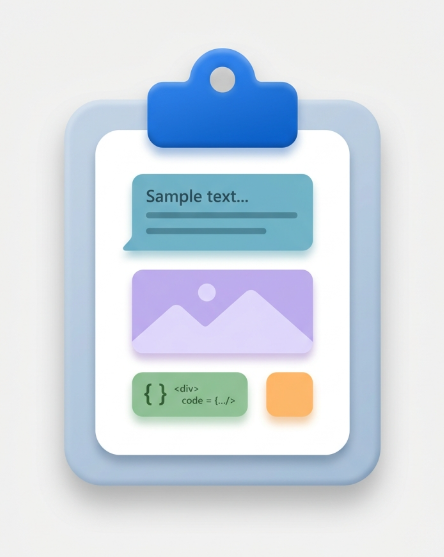
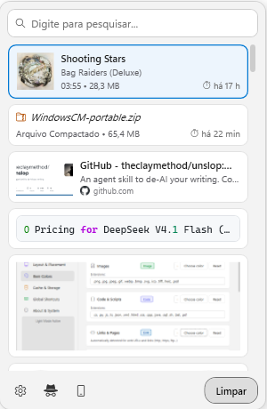
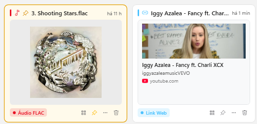
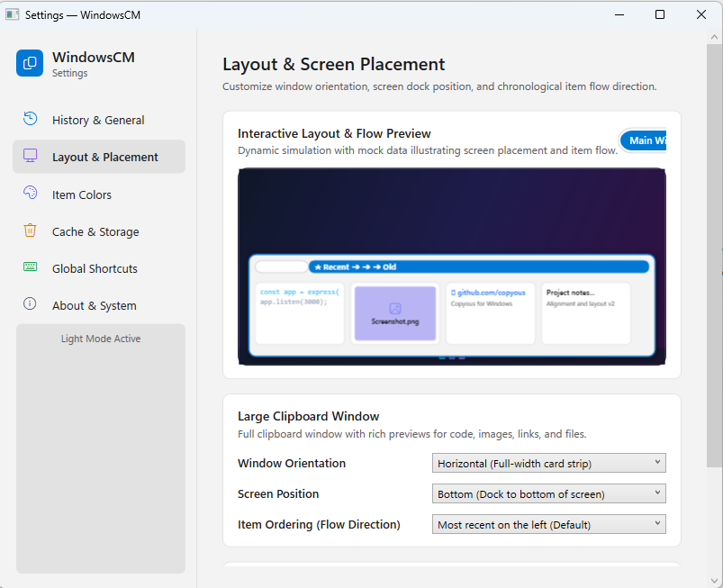
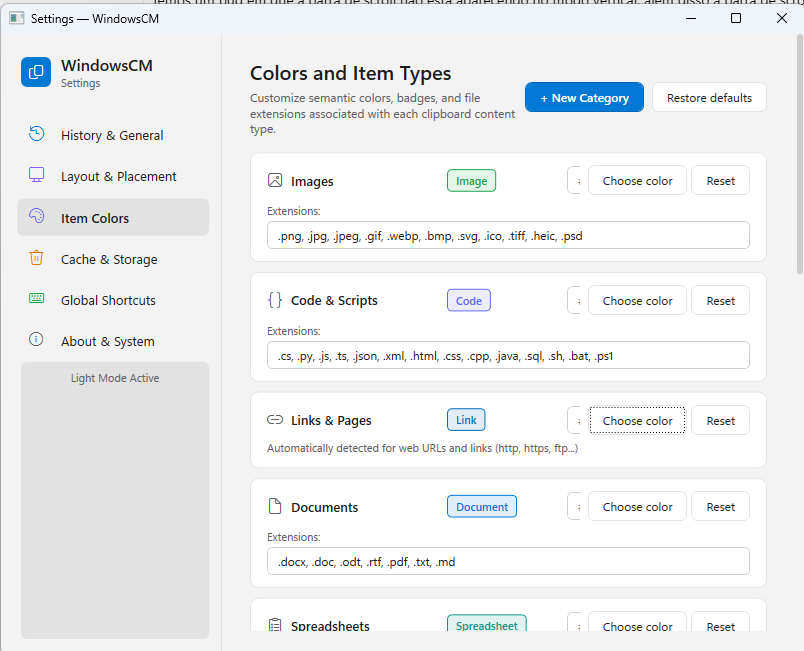
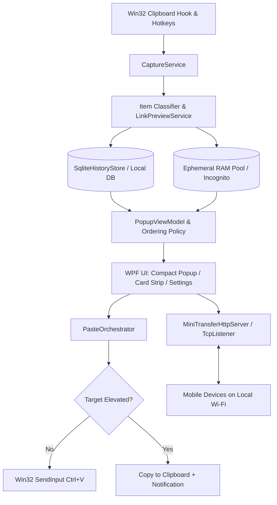

<p align="center">
  
</p>

<h1 align="center">WindowsCM</h1>

<p align="center">
  <strong>Fast, visual clipboard manager for Windows 11 with full parity to GNOME Copyous.</strong><br />
  Rich multi-format card previews, cursor-anchored compact popup, local Wi-Fi mobile transfer, and an ephemeral RAM-only incognito session.
</p>

<p align="center">
  <a href="https://dotnet.microsoft.com/download/dotnet/8.0"></a>
  <a href="https://www.microsoft.com/windows"></a>
  <a href="LICENSE"></a>
  
  
</p>

---

## Overview

WindowsCM brings the fluid, card-centric clipboard workflow of GNOME Copyous to Windows 11. Built with C#, .NET 8, and WPF, it replaces the standard Windows clipboard history (`Win+V`) with a responsive, keyboard-driven interface tailored for developers, writers, and power users.

Instead of plain text snippets, WindowsCM categorizes copies into semantic cards with syntax-highlighted code, high-resolution YouTube and OpenGraph thumbnails, album art for audio files, color swatches, and native Windows Shell thumbnails for photos, videos, and office documents.

<p align="center">
  
  <br />
  <em>Compact popup anchored under cursor with instant search, syntax highlighting, media metadata, and YouTube previews.</em>
</p>

---

## Visual Tour

<p align="center">
  
  <br />
  <em>Rich cards: FLAC audio with embedded album art and duration; YouTube URL with video thumbnail and channel details.</em>
</p>

<br />

<p align="center">
  
  
  <br />
  <em>Left: Interactive monitor layout preview and dock configuration. Right: Semantic file categories, custom extensions, and accent colors.</em>
</p>

---

## Key Features

### 1. Dual Interface: Agile Compact Popup & Expanded Card Strip
- **Compact Popup (`Ctrl+Shift+V`)**: Opens directly under the mouse pointer. Features a top search bar, fast arrow-key navigation, and instantaneous paste on `Enter` or copy-only on `Shift+Enter`. Configurable in vertical (`320x480px`) or horizontal (`540x240px`) format.
- **Large Clipboard Window**: An expansive card strip with horizontal mouse-wheel scrolling (`250x230px` per card). Dockable to the bottom, top, left, or right edges of your display with customizable chronological flow directions (`Recent on Left/Top` vs `Recent on Right/Bottom`).

### 2. Rich Multi-Format Previews & Shell Thumbnails
WindowsCM automatically identifies 8 distinct clipboard kinds and presents them with dedicated renderers:
- **Code & Scripts**: Displays multi-line snippets in monospace font (`Cascadia Code` / `Consolas`) with line numbers and syntax tokenization.
- **Web Links & YouTube**: Fetches OpenGraph metadata, site titles, favicons, and high-definition YouTube video thumbnails (`img.youtube.com`) in the background.
- **Audio Files**: Reads embedded ID3 / Vorbis tags to show album artwork, track title, artist name, and audio duration.
- **Photos, Videos & Documents**: Native integration with `IShellItemImageFactory` renders Windows Explorer thumbnails directly on the card for video frames, images, presentations, and PDFs.
- **Colors & Hex Swatches**: Parses color codes (`HEX`, `RGB`, `HSL`), displays visual swatch cards, and provides instant color format conversion.
- **Emojis**: Built-in multi-emoji classifier with full-color Unicode rendering.

### 3. Ephemeral Incognito Session
- Activate with `Ctrl+Shift+Alt+V`, the tray menu, or the hat-and-glasses icon.
- Clips copied during an incognito session live strictly in RAM (`EphemeralImageAssetStore`).
- Zero disk writes, zero SQLite transactions.
- You can search, browse, and paste incognito items freely. Once you exit incognito mode, the memory pool is cleared immediately, leaving no trace on disk.

### 4. Bidirectional Mobile Transfer via QR Code & Local Wi-Fi
- Built-in asynchronous HTTP server powered by `TcpListener` that requires **zero administrator privileges**, zero firewall configuration, and zero third-party cloud accounts.
- **PC to Mobile**: Click the QR button on any clipboard card (text, code, image, audio, or document). Scanning the QR code with your smartphone opens a mobile web client with audio playback or direct file download.
- **Mobile to PC**: Click the phone button (`Send from phone`) in the header to display a pairing QR code. Scan it to upload photos, audio recordings, files, or text from your smartphone straight into the Windows clipboard and WindowsCM history.

### 5. Configurable Semantic File Categories & Colors
- Replaced legacy color tags with customizable file categories: *Images*, *Audio*, *Video*, *Documents*, *Spreadsheets*, *Presentations*, *Code*, and *Archives*.
- Add custom file extensions, define new categories, and set custom hex accent colors in Settings.
- Unregistered extensions dynamically fall back to Windows Registry `PerceivedType` classifications.

### 6. UIPI Protection & Safe Paste Orchestration
- **Elevated Window Detection**: Windows User Interface Privilege Isolation (UIPI) drops synthetic keystrokes sent from standard applications to elevated (Administrator) windows. WindowsCM detects elevated foreground targets (`IsTargetElevated`) and falls back safely to clipboard-copy mode with an informative balloon notification instead of dropping the paste silently.
- **Idempotent Input Pipeline**: Clean focus restoration and input injection via Win32 `SendInput`, protecting against double-paste race conditions.

### 7. Windows 11 Fluent UI & Accessibility
- Native Windows 11 design language: rounded corners, Segoe Fluent Icons, subtle surface elevation, and system accent tinting.
- Full support for **Dark Mode**, **Light Mode**, and high-visibility **High Contrast Mode** (`#000000` deep black surface with crisp `#FFFFFF` borders).
- Follows Windows system theme changes automatically.

### 8. Strict Bilingual Parity
- 100% localized in **English** and **Brazilian Portuguese**.
- Switch languages on the fly in Settings with immediate runtime resource invalidation (no app restart required).

---

## Keyboard Shortcuts

| Shortcut | Context | Action |
| :--- | :--- | :--- |
| `Ctrl + Shift + V` | Global | Open Compact Clipboard Popup under mouse cursor |
| `Ctrl + Shift + Alt + V` | Global | Start or open Ephemeral Incognito session |
| `Enter` | Popup | Paste selected item into active window and close popup |
| `Shift + Enter` | Popup | Copy selected item to clipboard without pasting |
| `Left-Click` | Popup | Paste clicked item into active window |
| `Shift + Left-Click` | Popup | Copy clicked item to clipboard |
| `Delete` | Popup | Remove selected item from history |
| `P` | Popup | Pin or unpin selected item (prevents auto-deletion) |
| `Ctrl + Q` | Popup | Open QR Code transfer dialog for selected item |
| `Ctrl + F` / Type | Popup | Focus search bar and filter items |
| `Esc` | Popup | Close clipboard window without pasting |
| `Arrow Keys` | Popup | Navigate items (Up/Down or Left/Right according to layout) |
| `Home` / `End` | Popup | Jump to the newest or oldest clipboard item |

---

## Architecture

WindowsCM is engineered with clear separation between a pure, dependency-free domain core and the WPF desktop shell:



- **`WindowsCM.Core`**: Zero UI dependencies. Houses the SQLite storage engine, classifiers, OpenGraph parsers, YouTube thumbnail extractors, keyboard maps, placement mathematics, and the async HTTP server.
- **`WindowsCM.App`**: WPF presentation layer. Implements dynamic resource localization, Segoe Fluent Icons, custom window chrome, and Win32 shell interop (`IShellItemImageFactory`).
- **`WindowsCM.Core.Tests`**: 1,030 automated unit tests guaranteeing behavioral stability across placement, classification, ordering, serialization, and paste dispatching.

---

## Installation & Downloads

Pre-built binaries for Windows 10 and Windows 11 (x64) are available in each [GitHub Release](../../releases):

| Format | File | Details |
| :--- | :--- | :--- |
| **Portable** | `WindowsCM-portable.zip` | Standalone single-file executable. Extract and run `WindowsCM.exe` anywhere with zero installation. |
| **Installer** | `WindowsCM-Setup-1.0.0.exe` | Clean per-user installer generated with Inno Setup. No administrator privileges required. |

### System Requirements
- Windows 10 (version 1809 or newer) / Windows 11 (64-bit)
- [.NET 8.0 Desktop Runtime](https://dotnet.microsoft.com/download/dotnet/8.0) (included in self-contained builds)

---

## Building from Source

### Prerequisites
- [.NET 8.0 SDK](https://dotnet.microsoft.com/download/dotnet/8.0)
- Visual Studio 2022 or VS Code with C# Dev Kit
- [Inno Setup 6](https://jrsoftware.org/isinfo.php) (optional, required only for building the setup installer)

### Quick Build & Test

Clone the repository and compile the solution:

```powershell
git clone https://github.com/your-username/WindowsCM.git
cd WindowsCM

# Run test suite
dotnet test WindowsCM.sln

# Build Release
dotnet build WindowsCM.sln -c Release
```

### Packaging Distribution Artifacts

To compile the self-contained single-file portable build, generate the zip archive, and build the Inno Setup installer in a single command:

```powershell
powershell -ExecutionPolicy Bypass -File scripts/build-dist.ps1
```

All distribution artifacts will be generated in the `dist/` directory:
- `dist/WindowsCM-portable/`
- `dist/WindowsCM-portable.zip`
- `dist/WindowsCM-Setup-1.0.0.exe`

---

## Acknowledgments

- **[Copyous](https://github.com/philgale/copyous)** by Phil Gale — the outstanding GNOME extension that served as the design and functional inspiration for WindowsCM.
- **[QRCoder](https://github.com/codebude/QRCoder)** — lightweight QR code generation in pure .NET.

---

## License

This project is licensed under the [GNU General Public License v3.0 or later](LICENSE).