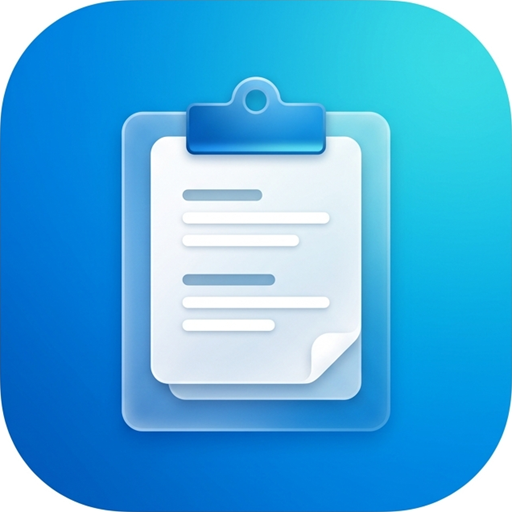
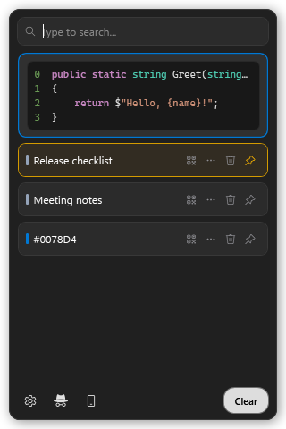
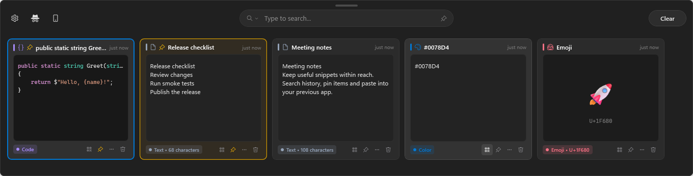
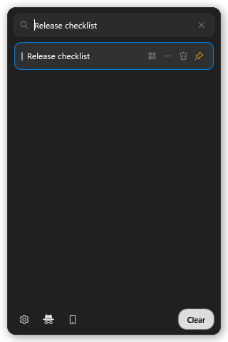
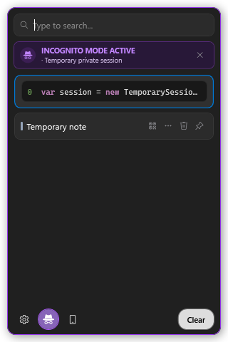
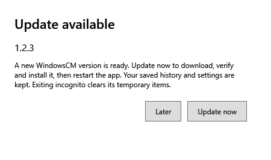
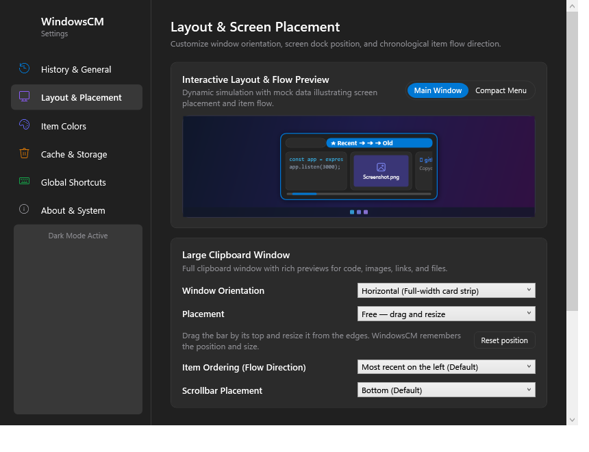
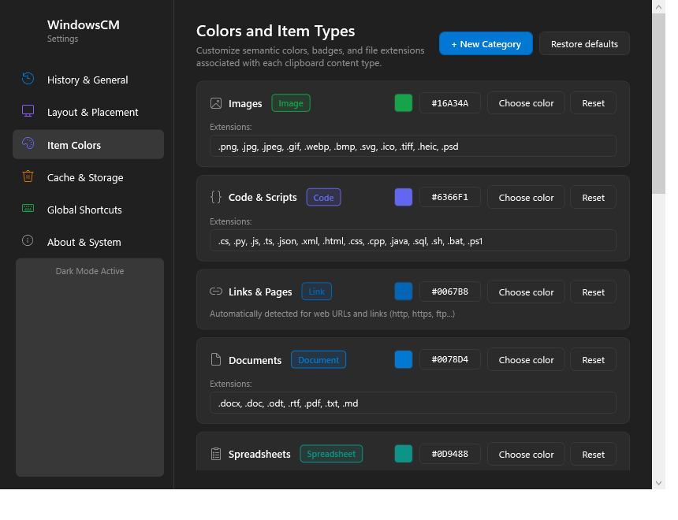

<p align="center">
  
</p>

<h1 align="center">WindowsCM</h1>
<p align="center">A visual clipboard manager for Windows, inspired by <a href="https://github.com/boerdereinar/copyous">Copyous</a>.</p>

Copy text, code, images or files as usual. WindowsCM keeps a searchable local history so you can reuse something you copied earlier. Open the compact menu next to your mouse, select an item and paste it into your previous application.

## Install and start

Download the latest package from [GitHub Releases](https://github.com/gabriel-s-flores/WindowsCM/releases/latest):

| Package | How to use it |
| --- | --- |
| `WindowsCM-Setup-<version>.exe` | Run the per-user installer. No administrator account is required. Launch WindowsCM from the Start menu. |
| `WindowsCM-portable-<version>.zip` | Extract the ZIP into a writable folder and run `WindowsCM.exe`. Keep `LICENSE` alongside it. |

Requires **Windows 10 20H2 (build 19042) or later, or Windows 11, x64**. Release packages include the .NET runtime; you do not need to install it separately.

WindowsCM runs in the notification area. The welcome guide explains the shortcuts and lets you enable launch at sign-in. If the tray icon is hidden, look in the notification area's overflow menu.

1. Copy a few items in any application.
2. Click the field where you want to paste.
3. Press **Ctrl+Shift+V** to open the compact menu.
4. Search or use the arrow keys, then select an item.
5. With **Paste automatically** enabled (the default), WindowsCM pastes into the previous field. Hold **Shift** while selecting to copy only.

The tray menu also opens the large clipboard window and Settings. WindowsCM uses its own shortcuts; Windows' built-in clipboard history remains available.

## Clipboard history at a glance

<p align="center"></p>

- **Search and pins:** find saved items quickly and pin frequently used snippets. Configure history size and age limits in Settings; protected pins survive ordinary clearing.
- **Eight item types:** text, code, images, a file, multiple files, links, characters and colors. Cards provide code highlighting, color information, image previews and file details. Link previews and native file thumbnails depend on the source and availability of metadata.
- **Two windows:** a compact menu near the pointer and a larger card window. Both support horizontal or vertical layouts and configurable item order. Place the large window on a screen edge, on a fixed monitor, or drag and resize it in free placement mode.
- **Item actions:** edit content or titles, copy, pin, delete, convert colors and use QR actions. Custom actions are configured in `actions.json`.
- **Appearance:** dark, light and high-contrast schemes, configurable item colors and file categories. English and Brazilian Portuguese can be switched in Settings without restarting.
- **Capture controls:** configure excluded applications, history limits, shortcuts and feedback in Settings.



| Search a pinned item | Browse an incognito session |
| --- | --- |
|  |  |

## Incognito mode

Press **Ctrl+Shift+Alt+V** or use the incognito control to start an isolated session. Incognito history is held in memory rather than the saved history. Image assets use an isolated temporary folder that is cleaned when the session ends. You can search and paste them while the session is active. Hiding a window does not end the session; **explicitly exiting incognito clears its temporary items**. Updating or quitting the app also ends the session.

Incognito controls WindowsCM's own storage. It does not prevent other applications or Windows clipboard services from observing copied content.

## Transfer between your phone and PC

Use the QR action on an item to open it on your phone, or **Send from phone** to receive text and files on the PC. Scan the displayed QR code with your phone's camera and open the local web page.

Both devices must be on a network that allows them to reach each other. Transfer uses a temporary local HTTP server, with no cloud account. Network isolation or Windows Firewall rules can prevent access. Only share the QR link with devices you trust and close the transfer window when finished.

## Automatic updates

WindowsCM checks the latest stable GitHub release when a packaged app starts and every **six hours** while it is running. If a newer version has the matching package and checksum file, an update prompt appears.

<p align="center"></p>

- **Update now** downloads the matching package, checks its SHA-256 checksum and restarts WindowsCM after applying it. Installed copies use the per-user installer; portable copies replace the executable in their existing folder.
- **Later** leaves the app running and suppresses that version's prompt for the current session. It can be offered again after you restart.
- Saved history, settings and actions are kept. An active incognito session ends during restart.
- If the download or checksum validation fails, the running app remains open and you can retry. If applying the update fails, the next launch reports the failure. Portable updates require a writable app folder.
- Offline checks do not interrupt clipboard use. Prereleases are excluded. Updating requires access to GitHub.

This feature starts working after installing a build that includes it. Older WindowsCM versions need one manual update first.

## Settings




## Useful shortcuts

| Shortcut or gesture | Action |
| --- | --- |
| `Ctrl+Shift+V` | Open the compact menu |
| `Ctrl+Shift+Alt+V` | Start or open incognito |
| Arrow keys | Navigate items |
| `Enter` / click an item | Use the selected item; paste automatically if enabled |
| `Shift+Enter` / Shift+click | Copy without pasting |
| `Ctrl+S` | Pin or unpin the selected item |
| `Delete` | Delete the selected item when the item list has focus |
| `Esc` | Close the popup |

Global shortcuts are configurable in Settings. If a shortcut is already registered by another app, WindowsCM reports the conflict. Pasting into an elevated application may fall back to copying: paste manually in that application.

## Local data and license

Saved history, images, caches and logs live under `%LOCALAPPDATA%\WindowsCM`. Settings and custom actions live under `%APPDATA%\WindowsCM`. The portable package uses these same user data locations. Ordinary upgrades keep this data; uninstalling keeps it unless you explicitly choose removal.

WindowsCM is licensed under [GPL-3.0-or-later](LICENSE). It is inspired by [Copyous](https://github.com/boerdereinar/copyous) and its [Pano](https://github.com/oae/gnome-shell-pano) lineage.

## Developer notes

### Dependencies and local development

Use Windows with the [.NET 8 SDK](https://dotnet.microsoft.com/download/dotnet/8.0). Visual Studio 2022 with desktop .NET development support is optional. Packaging additionally requires [Inno Setup 6](https://jrsoftware.org/isinfo.php), with `ISCC.exe` on `PATH` or in a standard installation location.

NuGet dependencies are restored automatically. No separate database service or Node.js installation is needed.

```powershell
git clone https://github.com/gabriel-s-flores/WindowsCM.git
cd WindowsCM
$env:DOTNET_CLI_UI_LANGUAGE = 'en'
dotnet restore WindowsCM.sln
dotnet build WindowsCM.sln -c Release
dotnet test WindowsCM.sln -c Release
dotnet run --project src/WindowsCM.App/WindowsCM.App.csproj
```

Development builds do not run the automatic updater. The app starts in the tray; use its hotkey or tray menu. Command-line options include `--hidden`, `--show`, `--hide`, `--toggle` and `--help`. Commands sent by a second launch are forwarded to the running instance.

### Smoke tests and README captures

The isolated WPF harness exercises production windows with fixture data, without capturing your clipboard or modifying your saved history:

```powershell
powershell -ExecutionPolicy Bypass -File scripts/smoke/ui-stress.ps1 -Cards 500
dotnet run --project scripts/smoke/WindowsCM.UiStress -c Release -- screenshots assets
```

The screenshot scenario renders the actual English window content into PNG files and checks pinned search, settings navigation and live localization of the update prompt. The update screenshot uses an example version. The incognito scenario uses an isolated session, checks that exiting clears its temporary history, and verifies that the normal history is preserved.

`app-smoke.ps1` and `scroll-smoke.ps1` additionally drive the real app on a Windows desktop. **They delete the current user's WindowsCM data and require `-ResetUserData`; run them only on a disposable account or CI runner.**

### Build portable and installer packages

```powershell
powershell -ExecutionPolicy Bypass -File scripts/build-dist.ps1
```

The script closes running WindowsCM processes and creates both packages in `dist/`:

- `WindowsCM-portable/WindowsCM.exe` and `LICENSE`
- `WindowsCM-portable.zip`
- `WindowsCM-Setup-1.0.0.exe`

To stamp a release version into the app and installer:

```powershell
powershell -ExecutionPolicy Bypass -File scripts/build-dist.ps1 -Version 1.2.3
```

### Release contract and project structure

CI builds and tests changes, runs desktop smoke tests, and publishes a new patch release after a successful push to `main`. It stamps the same version into the app and installer and uploads `WindowsCM-Setup-<version>.exe`, `WindowsCM-portable-<version>.zip`, and `SHA256SUMS.txt`. Preserve these names and the `v<major>.<minor>.<patch>` tag format: the updater selects assets by exact name. It uses GitHub's [latest stable release API](https://docs.github.com/en/rest/releases/releases#get-the-latest-release) and verifies the package against `SHA256SUMS.txt` before applying it.

| Directory | Responsibility |
| --- | --- |
| `src/WindowsCM.Core` | Capture, classification, SQLite history, paste policies, settings, transfer and update checks |
| `src/WindowsCM.App` | WPF windows, tray, Win32 adapters and update installation |
| `tests/WindowsCM.Core.Tests` | Automated behavior and localization regression tests |
| `scripts/smoke` | Desktop smoke scripts and isolated WPF harness |
| `installer` | Inno Setup installer definition |

See [CONTEXT.md](CONTEXT.md) and [architecture decisions](docs/adr/) for domain and design details. All repository prose and code are English. New user-facing text must have English and Portuguese catalog entries, use dynamic localization resources in XAML, and pass `LocalizationTests`.
